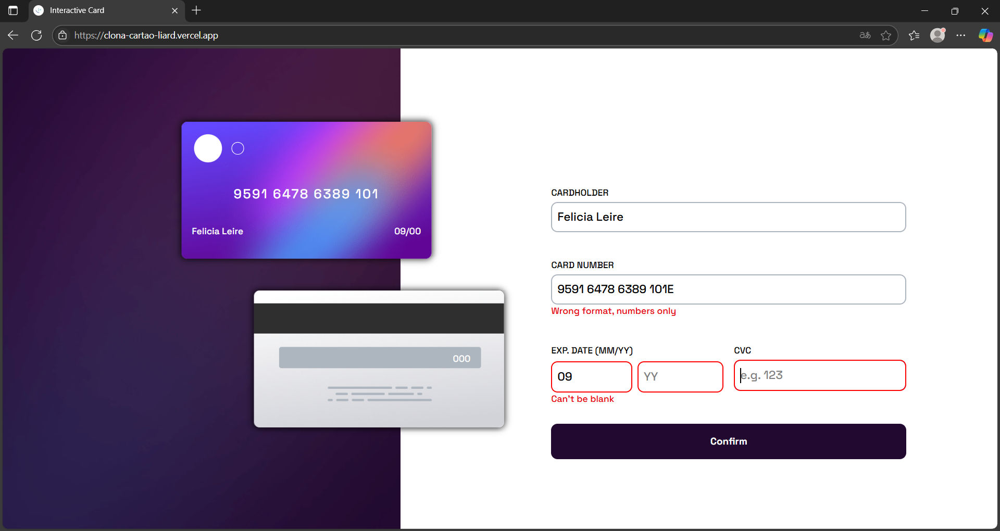
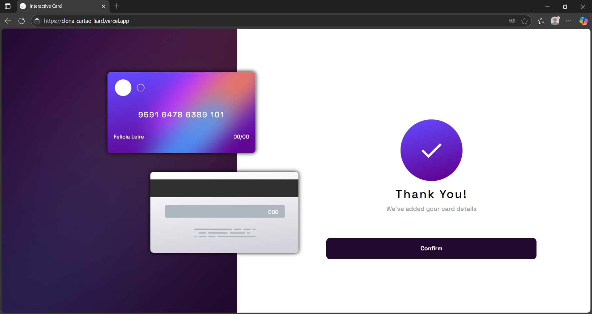
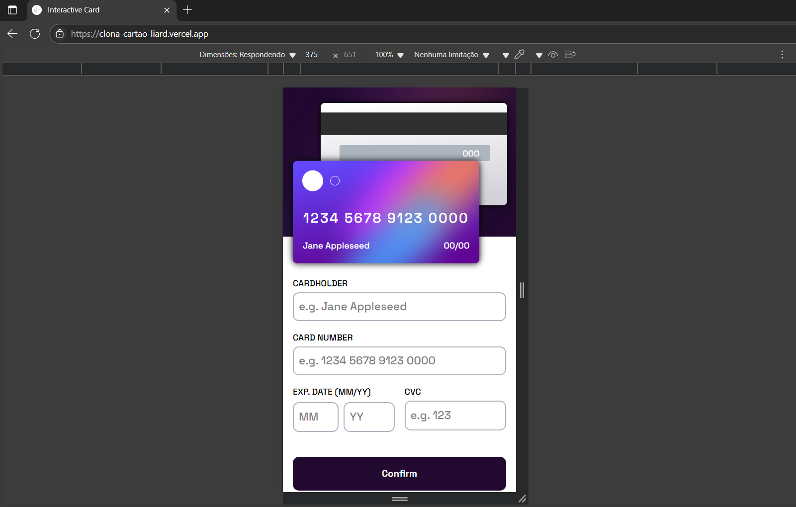
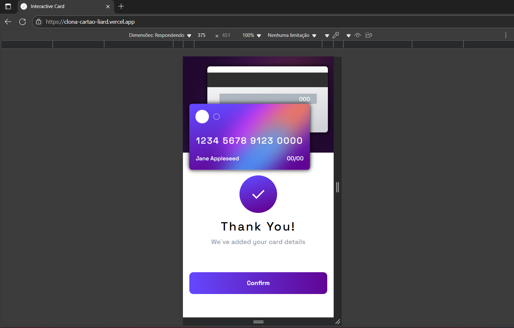

## Frontend Mentor – Interative Card Details Form

Este repositório apresenta minha solução para o desafio [Interactive Card Details Form](https://www.frontendmentor.io/challenges/interactive-card-details-form-XpS8cKZDWw) do Frontend Mentor. O objetivo principal é aprimorar minhas habilidades em desenvolvimento frontend, especialmente com React e Tailwind CSS.

---

## Índice


- [Visão Geral](#visão-geral)
  - [O Desafio](#o-desafio)
  - [Captura de Tela](#captura-de-tela)
  - [Links](#links)
- [Meu Processo](#meu-processo)
  - [Tecnologias Utilizadas](#tecnologias-utilizadas)
  - [Aprendizados](#aprendizados)
  - [Próximos Passos](#próximos-passos)
  - [Recursos](#recursos)
- [Autor](#autor)

---

## Visão Geral

### O Desafio

O usuário deve conseguir:

- Preencher o formulário e ver os detalhes do cartão atualizarem em tempo real.
- Receber mensagens de erro ao enviar o formulário se:
    - Algum campo estiver vazio.
    - O número do cartão, a data de validade ou o CVC estiverem em formato incorreto.
- Visualizar o layout ideal de acordo com o tamanho da tela do dispositivo.
- Ver os estados hover, active e focus nos elementos interativos da página.

### Captura de Tela

### Captura de Tela

Confira abaixo diferentes telas e estados da aplicação:

<div align="center">

### Visualização Desktop

|  |  |  |
|:--:|:--:|:--:|
| Layout geral na visualização desktop. | Estados ativos dos campos no formulário. | Tela de confirmação completa em desktop. |

&nbsp;

### Visualização Mobile

|  |  |
|:--:|:--:|
| Layout geral na visualização mobile. | Tela de confirmação completa em mobile. |

</div>

### Links

- **Demo ao vivo:** [https://interactive-card-liard.vercel.app](https://clona-cartao-liard.vercel.app)
- **Repositório:** [https://github.com/fabiomoretao/interactive-card](https://github.com/fabiomoretao/interactive-card)

---

## Meu Processo

### Tecnologias Utilizadas

- **React** – biblioteca JavaScript para interfaces.
- **Tailwind CSS** – framework utilitário para estilização.
- Flexbox e CSS Grid
- Abordagem mobile-first

### Aprendizados

- Integração de Tailwind CSS com React para criar layouts dinâmicos.
- Uso de CSS `transform` e `translate` para posicionamento preciso de elementos.

Exemplo de alinhamento responsivo usando Tailwind:

```jsx
<div className="w-[80%] absolute transform -translate-y-[80%] flex flex-col items-center mx-4
      laptop:translate-y-[50%] laptop:translate-x-[50%]
      laptop-lg:translate-y-full laptop-lg:translate-x-[60%]">
  {/* Conteúdo */}
</div>

```

### Próximos Passos

- Explorar componentes prontos com bibliotecas como [Material UI (MUI)](https://mui.com/), [Shadcn UI](https://ui.shadcn.com/) ou [Chakra UI](https://chakra-ui.com/).
- Aprofundar o uso de Next.js e otimizar ainda mais a responsividade.

### Recursos

Durante o desenvolvimento dessa solucão descobri algumas ferramentas que proporcionam componentes prontos, como [Materia UI (MUI)](https://mui.com/), [shadcn](https://ui.shadcn.com/) e [chakra](https://chakra-ui.com/). E pretendo usar algum deles no próximo projeto

---

## Autor

**Fábio José Moretão de Souza**

- Frontend Mentor – [@fabiomoretao](https://www.frontendmentor.io/profile/fabiomoretao)
- Instagram – [@fabio_moretao](https://www.instagram.com/fabio_moretao)
- LinkedIn – [fabiomoretao](https://www.linkedin.com/in/fabiomoretao)
